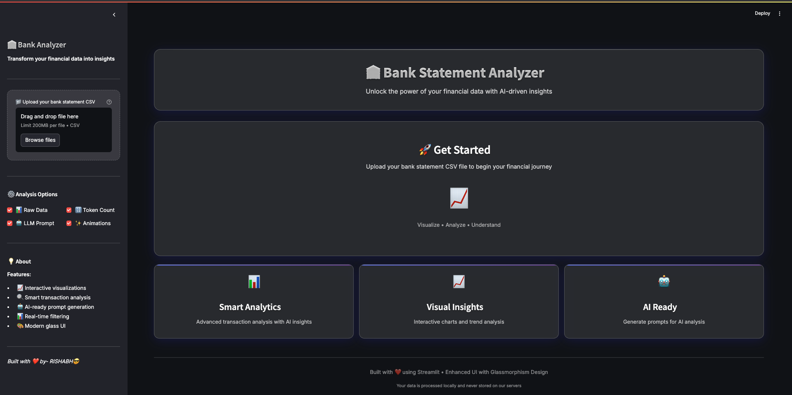
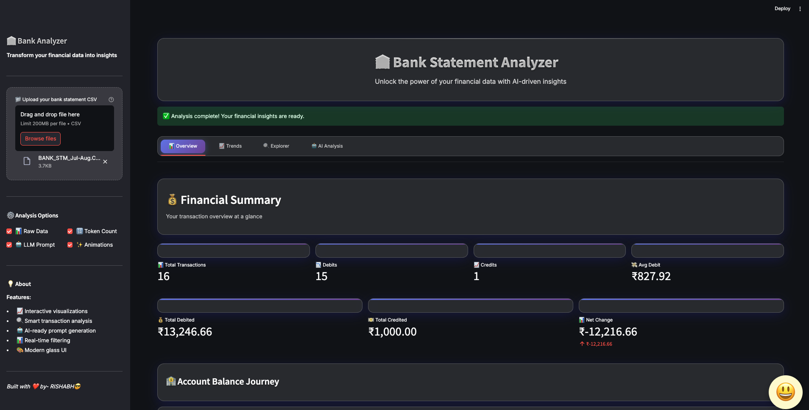
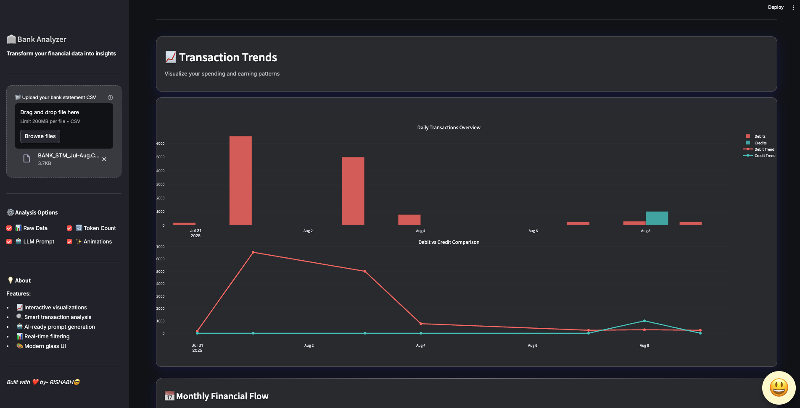
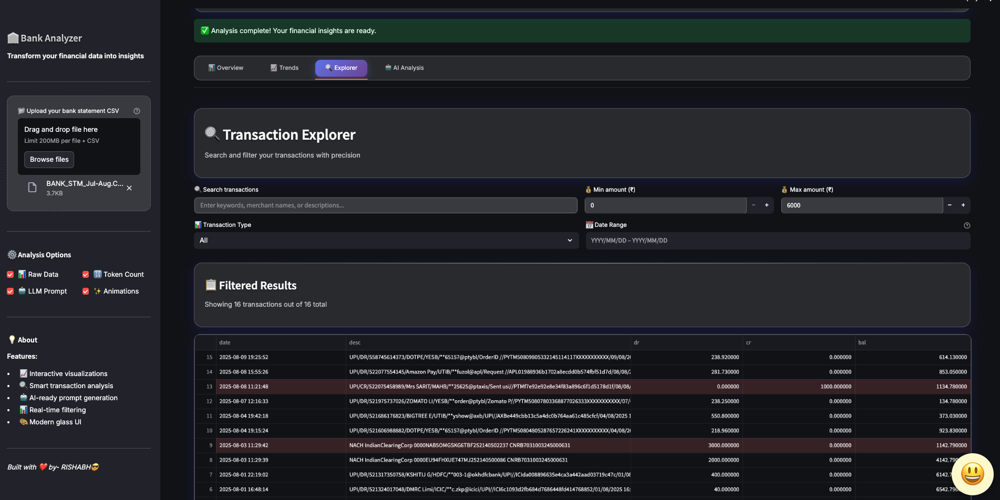
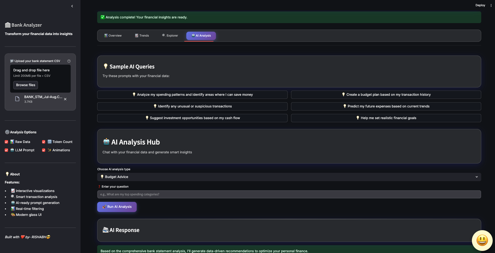

# Bank Statement Dashboard

  
**Track. Learn. Earn. — Your Bank Statement Analyser Dashboard**

---

## Table of Contents

- [Overview](#overview)
- [Features](#features)
- [Demo](#demo)
- [Getting Started](#getting-started)
  - [Prerequisites](#prerequisites)
  - [Installation](#installation)
  - [Usage](#usage)
- [Folder Structure](#folder-structure)
- [Technologies Used](#technologies-used)
- [Contributing](#contributing)
- [Contact](#contact)

---

## Overview

**Bank Statement Dashboard** is a Python-based tool designed to help users analyze, visualize, and gain insights from their bank statements. The dashboard provides easy-to-understand charts, detailed transaction breakdowns, and spending analytics to help you manage your finances efficiently.

---

## Features

- 📂 **Upload Bank Statements**: Supports common bank statement formats (CSV, XLSX,).[CANARA BANK]
- 📊 **Visual Analytics**: Pie charts, line graphs, and bar charts for your income and expenses.
- 🔍 **Transaction Categorization**: Automatically categorizes your transactions (e.g., groceries, utilities, shopping).
- 📅 **Time-based Filtering**: Analyze transactions by month, quarter, or year.
- 🏦 **Multi-Account Support**: Manage data from multiple bank accounts in one dashboard.
- 📈 **Savings & Spending Trends**: Identify patterns and set financial goals.
- 🔔 **Alerts & Recommendations**: Notifies you of unusual activity or overspending.
- 🗂️ **Export Reports**: Download custom spending reports as DOCS.

---

## Demo
> # Bank Statement Dashboard

## 📸 Dashboard Screenshots

### Main View


### Page 1
  

### Page 2
  

### Page 3


### Page 4
  

---

## Getting Started

### Prerequisites

- Python 3.7+
- pip (Python package manager)
- [Optional] Virtual Environment (`venv`, `virtualenv`, or `conda`)

### Installation

1. **Clone the Repository**
   ```sh
   git clone https://github.com/Rishabh-Sharma-12/BANK-STATEMENT-DASHBOARD.git
   cd BANK-STATEMENT-DASHBOARD
   ```

2. **Create and Activate Virtual Environment (Recommended)**
   ```sh
   python -m venv venv
   source venv/bin/activate  # On Windows use: venv\Scripts\activate
   ```

3. **Install Dependencies**
   ```sh
   pip install -r requirements.txt
   ```

### Usage

1. **Run the Application**
   ```sh
   python app.py
   ```
   or
   ```sh
   streamlit run app.py
   ```


---

## Folder Structure

```
BANK-STATEMENT-DASHBOARD/
│
├── data/                    # Sample and processed bank statement files
├── static/                  # Static files (images, CSS)
├── templates/               # HTML templates (if using Flask/Django)
├── src/                     # Source code (modules, utilities)
│   ├── __init__.py
│   ├── data_processing.py   # Data cleaning and parsing
│   ├── visualization.py     # Charting and plotting functions
│   └── categorization.py    # Categorization logic
├── app.py                   # Main application file
├── requirements.txt         # Python dependencies
├── README.md                # This file
└── LICENSE
```

---

## Technologies Used

- **Backend**: Python (Pandas, NumPy, Streamlit/Flask)
- **Frontend**: Streamlit, HTML, CSS
- **Visualization**: Matplotlib, Plotly, Seaborn
- **Data Processing**: Pandas, Regex
- **Exporting**: FPDF, CSV module

---

## Contributing

Contributions are welcome!  
If you have suggestions, bug reports, or want to add new features:

1. Fork the repository
2. Create your branch (`git checkout -b feature/YourFeature`)
3. Commit your changes (`git commit -am 'Add some feature'`)
4. Push to the branch (`git push origin feature/YourFeature`)
5. Open a [Pull Request](https://github.com/Rishabh-Sharma-12/BANK-STATEMENT-DASHBOARD/pulls)

---

## Contact

- **Author:** Rishabh Sharma
- **GitHub:** [@Rishabh-Sharma-12](https://github.com/Rishabh-Sharma-12)

---

> _Empower your financial journey. Track, Learn, and Earn with Bank Statement Dashboard!_
